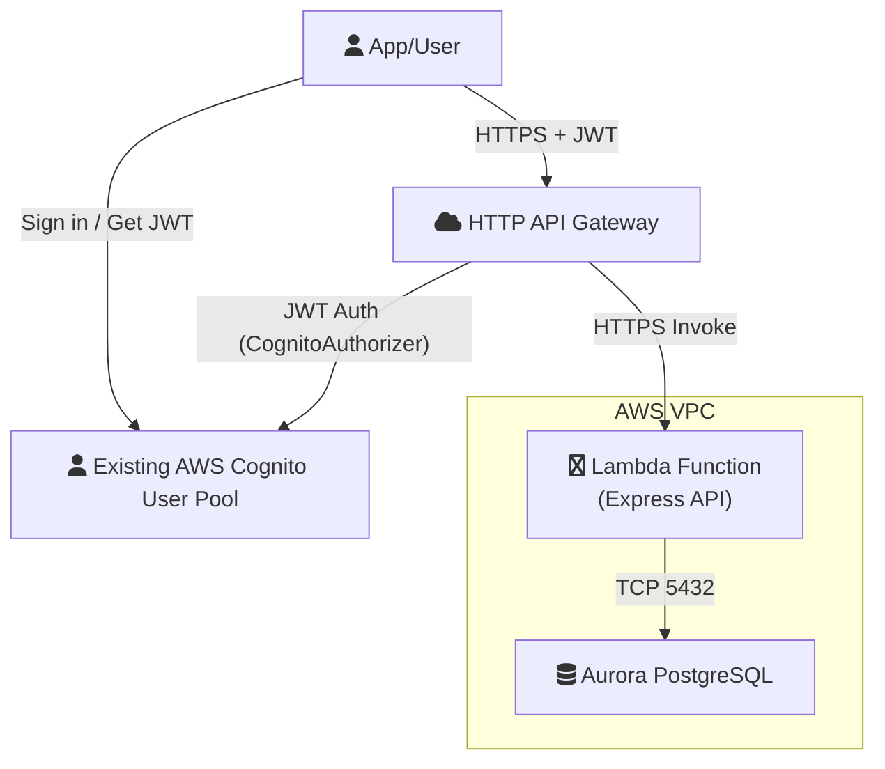

# AWS Infrastructure Explanation for `template.yaml`

This document explains each section of the `template.yaml` file, what AWS resources it creates, how to verify them in the AWS Console, and provides a network diagram using Mermaid.

---

## 1. Parameters
- **DBName, DBUsername, DBPassword**: Input parameters for the Aurora PostgreSQL database.
- **CognitoUserPoolArn, CognitoUserPoolId, CognitoUserPoolClientId**: Parameters for your existing Cognito User Pool and Client.
- **CorsAllowedOrigin**: Parameter for the allowed CORS origin.

## 2. Resources

### VPC and Networking
- **TrailVPC**: Creates a Virtual Private Cloud (VPC) for isolating resources.
- **TrailSubnet1 & TrailSubnet2**: Two subnets in different Availability Zones for high availability.
- **TrailDBSubnetGroup**: Groups the above subnets for RDS/Aurora usage.
- **TrailSecurityGroup**: Security group for Aurora, allows inbound PostgreSQL (5432) from Lambda.
- **LambdaSecurityGroup**: Security group for Lambda, allows outbound to Aurora.

### Database
- **TrailAuroraCluster**: Aurora PostgreSQL Serverless v2 cluster.
- **TrailAuroraInstance**: Instance for the Aurora cluster.

### API and Lambda
- **TrailCognitoAuthorizer**: Configures the HTTP API to use your existing Cognito User Pool for JWT authentication.
- **TrailHttpApi**: HTTP API Gateway for exposing your backend as a REST endpoint, protected by Cognito and CORS.
- **TrailBackendLambda**: Lambda function running your Express backend (from `backend/lambda.js`), integrated with the HTTP API and VPC.

---

## Cognito Authentication Layer (Reusing Existing User Pool)
- Uses your existing Cognito User Pool and Client for authentication.
- All API requests must include a valid JWT token from this pool.
- API Gateway validates the JWT before invoking Lambda.

---

## Network & Auth Flow Diagram

---

## How to Validate Everything in the AWS Console

After deploying your SAM template, you can verify each resource in the AWS Console as follows:

### 1. **VPC, Subnets, and Security Groups**
- Go to **VPC Dashboard**
  - **Your VPCs**: Confirm a VPC with CIDR `10.0.0.0/16` exists.
  - **Subnets**: Look for subnets with CIDRs `10.0.1.0/24` and `10.0.2.0/24`.
  - **Security Groups**: Find `TrailSecurityGroup` (for Aurora) and `LambdaSecurityGroup` (for Lambda). Check inbound/outbound rules.

### 2. **Aurora PostgreSQL Cluster**
- Go to **RDS Dashboard > Databases**
  - Confirm a cluster named `trail` (or your DBName parameter) with engine `aurora-postgresql` and mode `serverless`.
  - Click the cluster to see endpoints, status, and subnet group.

### 3. **Lambda Function**
- Go to **Lambda Dashboard > Functions**
  - Find `TrailBackendLambda`.
  - Check the configuration: VPC settings, environment variables, and permissions.
  - Test the function (optionally) with a test event.

### 4. **API Gateway (HTTP API)**
- Go to **API Gateway > HTTP APIs**
  - Find `TrailBackendApi`.
  - Check the **Routes** tab for `/{proxy+}`.
  - Under **Authorization**, confirm the Cognito authorizer is attached.
  - Under **CORS**, confirm your allowed origin is set.
  - Copy the **Invoke URL** (matches the `HttpApiUrl` output).

### 5. **Cognito User Pool (Existing)**
- Go to **Cognito > User Pools**
  - Find your existing user pool (ID matches the parameter you provided).
  - Under **App clients**, confirm the client ID matches your parameter.
  - Under **App integration > Domain name**, confirm the pool is configured for authentication.

### 6. **Test the API**
- Use a tool like **Postman** or **curl**:
  1. Authenticate with Cognito to get a JWT token (sign in as a user).
  2. Make a request to your API endpoint (`HttpApiUrl`) with the `Authorization: Bearer <JWT>` header.
  3. You should get a valid response from your backend if everything is set up correctly.
  4. Try calling the API without a token or with an invalid token to confirm it is blocked.

### 7. **Outputs**
- Go to **CloudFormation > Stacks > [Your Stack] > Outputs**
  - Find the values for `AuroraClusterEndpoint`, `AuroraClusterPort`, `LambdaFunctionName`, and `HttpApiUrl`.

---

## Updated Summary Table
| Resource                      | AWS Console Location                | Purpose                                 |
|-------------------------------|-------------------------------------|-----------------------------------------|
| CognitoUserPoolArn (param)    | Cognito > User Pools                | User authentication (JWT, existing pool) |
| CognitoUserPoolClientId (param)| Cognito > User Pools > App clients  | App client for authentication           |
| TrailCognitoAuthorizer        | API Gateway > HTTP APIs > Authorizers| JWT validation for API                  |
| TrailHttpApi                  | API Gateway > HTTP APIs             | Public API endpoint (Cognito protected) |
| TrailVPC                      | VPC > Your VPCs                     | Network isolation                       |
| TrailSubnet1/2                | VPC > Subnets                       | High availability for DB/Lambda         |
| TrailDBSubnetGroup            | RDS > Subnet groups                 | Aurora subnet group                     |
| TrailSecurityGroup            | EC2 > Security Groups               | Aurora access control                   |
| LambdaSecurityGroup           | EC2 > Security Groups               | Lambda access control                   |
| TrailAuroraCluster            | RDS > Databases                     | PostgreSQL database                     |
| TrailAuroraInstance           | RDS > Databases > Instances         | DB compute resource                     |
| TrailBackendLambda            | Lambda > Functions                  | Express backend                         |

---

*This document was updated to remove duplicate validation instructions and keep them only in the dedicated section, as per your request.*
