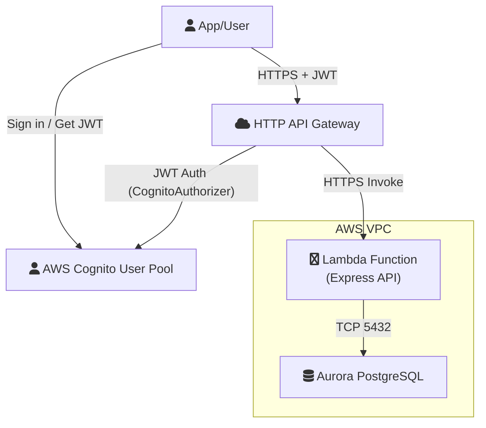

# AWS Infrastructure Explanation for `template.yaml`

This document explains each section of the `template.yaml` file, what AWS resources it creates, how to verify them in the AWS Console, and provides a network diagram using Mermaid.

---

## 1. Parameters
- **DBName, DBUsername, DBPassword**: These are input parameters for the Aurora PostgreSQL database. You provide these values during deployment.

## 2. Resources

### VPC and Networking
- **TrailVPC**: Creates a Virtual Private Cloud (VPC) for isolating resources.
  - *Check in Console*: VPC Dashboard > Your VPCs > Look for `10.0.0.0/16` CIDR.
- **TrailSubnet1 & TrailSubnet2**: Two subnets in different Availability Zones for high availability.
  - *Check in Console*: VPC Dashboard > Subnets > Look for `10.0.1.0/24` and `10.0.2.0/24`.
- **TrailDBSubnetGroup**: Groups the above subnets for RDS/Aurora usage.
  - *Check in Console*: RDS Dashboard > Subnet groups > `trail-db-subnet-group`.
- **TrailSecurityGroup**: Security group for Aurora, allows inbound PostgreSQL (5432) from Lambda.
  - *Check in Console*: EC2 Dashboard > Security Groups > Description matches.
- **LambdaSecurityGroup**: Security group for Lambda, allows outbound to Aurora.
  - *Check in Console*: EC2 Dashboard > Security Groups > Description matches.

### Database
- **TrailAuroraCluster**: Aurora PostgreSQL Serverless v2 cluster.
  - *Check in Console*: RDS Dashboard > Databases > Engine: Aurora PostgreSQL, Mode: Serverless v2.
- **TrailAuroraInstance**: Instance for the Aurora cluster.
  - *Check in Console*: RDS Dashboard > Databases > Instances tab.

### API and Lambda
- **TrailHttpApi**: HTTP API Gateway for exposing your backend as a REST endpoint.
  - *Check in Console*: API Gateway > HTTP APIs > Name: `TrailBackendApi`.
- **TrailBackendLambda**: Lambda function running your Express backend (from `backend/lambda.js`).
  - *Check in Console*: Lambda > Functions > Name: `TrailBackendLambda`.
  - *Integration*: Connected to the HTTP API for all routes (`/{proxy+}`), and runs inside the VPC for DB access.

### Cognito Authentication
- **TrailCognitoUserPool**: Creates a Cognito User Pool for user authentication (sign-up/sign-in, JWT token issuance).
  - *Check in Console*: Cognito > User Pools > Name: `TrailUserPool`.
- **TrailCognitoUserPoolClient**: App client for the User Pool, used by your frontend to authenticate and obtain tokens.
  - *Check in Console*: Cognito > User Pools > TrailUserPool > App clients > Name: `TrailUserPoolClient`.
- **TrailCognitoAuthorizer**: Configures the HTTP API to use Cognito JWT tokens for authentication.
  - *Check in Console*: API Gateway > HTTP APIs > TrailBackendApi > Authorization > Authorizers > CognitoAuthorizer.
- **TrailHttpApi**: Now has Cognito as the default authorizer for all routes. Only requests with a valid Cognito JWT token will reach your Lambda/backend.

## 3. Environment Variables
- Lambda receives DB connection info and other config as environment variables, matching your backend's `config.js` usage.

## 4. IAM Permissions

- **Lambda IAM Role**:  
  The Lambda function is automatically assigned an IAM role with the following permissions:
  - `AWSLambdaVPCAccessExecutionRole`: Allows Lambda to manage network interfaces in your VPC so it can connect to resources like Aurora.
  - `rds-db:connect`: Allows Lambda to connect to the RDS/Aurora database (required for IAM authentication if enabled).
  - (Optional) `secretsmanager:GetSecretValue`: If you use AWS Secrets Manager for DB credentials, this permission is needed.

  *Check in Console*:  
  - Go to IAM > Roles > Find the role associated with your Lambda function (usually named after the function).  
  - Review the attached policies and permissions.

## 5. Networking: Are Lambda and Aurora in the Same Network?

**Yes.**  
Both the Lambda function and the Aurora cluster are deployed inside the same VPC and share the same subnets and security groups. This ensures:
- **Private, secure communication** between Lambda and Aurora (no public internet exposure).
- **Security groups** control which resources can talk to each other (Lambda can reach Aurora on port 5432).

---

## 6. Outputs
- **AuroraClusterEndpoint**: The hostname for connecting to the DB.
- **AuroraClusterPort**: The port (5432).
- **LambdaFunctionName**: The deployed Lambda's name.
- **HttpApiUrl**: The public URL for your API.

---

## How the Network Looks

- Users authenticate with Cognito and receive a JWT token.
- All API requests must include the JWT in the `Authorization` header.
- API Gateway validates the JWT with Cognito before invoking Lambda.
- Lambda runs your Express app, connects to Aurora over the private VPC network.

---

## How to Check Resources in AWS Console (Updated)
1. **Cognito User Pool & Client**: Cognito > User Pools > TrailUserPool
2. **API Gateway Authorizer**: API Gateway > HTTP APIs > TrailBackendApi > Authorization
3. **VPC/Subnets/Security Groups**: VPC Dashboard > Your VPCs/Subnets/Security Groups
4. **Aurora Cluster**: RDS Dashboard > Databases
5. **Lambda Function**: Lambda Dashboard > Functions
6. **API Gateway**: API Gateway Dashboard > HTTP APIs
7. **Outputs**: After deployment, use the AWS SAM CLI output or CloudFormation > Stacks > [Your Stack] > Outputs

---

## Updated Summary Table
| Resource                      | AWS Console Location                | Purpose                                 |
|-------------------------------|-------------------------------------|-----------------------------------------|
| TrailCognitoUserPool          | Cognito > User Pools                | User authentication (JWT)               |
| TrailCognitoUserPoolClient    | Cognito > User Pools > App clients  | App client for authentication           |
| TrailCognitoAuthorizer        | API Gateway > HTTP APIs > Authorizers| JWT validation for API                  |
| TrailHttpApi                  | API Gateway > HTTP APIs             | Public API endpoint (Cognito protected) |
| TrailVPC                      | VPC > Your VPCs                     | Network isolation                       |
| TrailSubnet1/2                | VPC > Subnets                       | High availability for DB/Lambda         |
| TrailDBSubnetGroup            | RDS > Subnet groups                 | Aurora subnet group                     |
| TrailSecurityGroup            | EC2 > Security Groups               | Aurora access control                   |
| LambdaSecurityGroup           | EC2 > Security Groups               | Lambda access control                   |
| TrailAuroraCluster            | RDS > Databases                     | PostgreSQL database                     |
| TrailAuroraInstance           | RDS > Databases > Instances         | DB compute resource                     |
| TrailBackendLambda            | Lambda > Functions                  | Express backend                         |

---

*This document was updated to reflect Cognito authentication at the API Gateway level as defined in `template.yaml`.*
